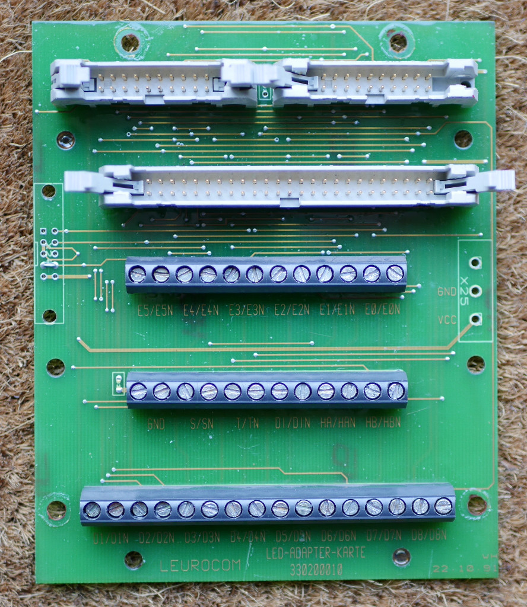
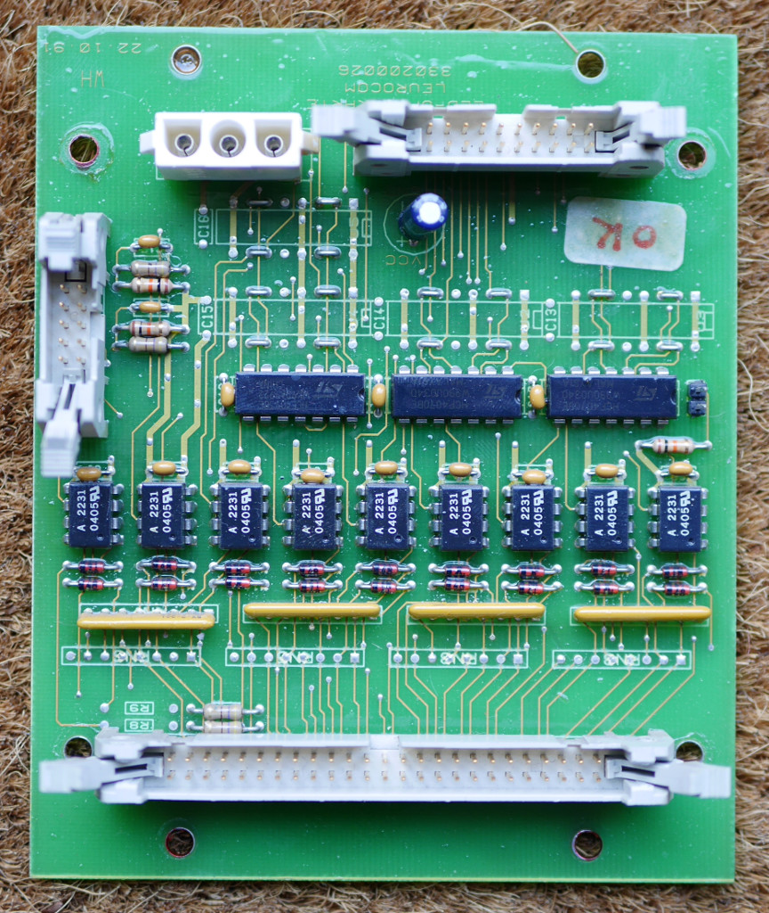
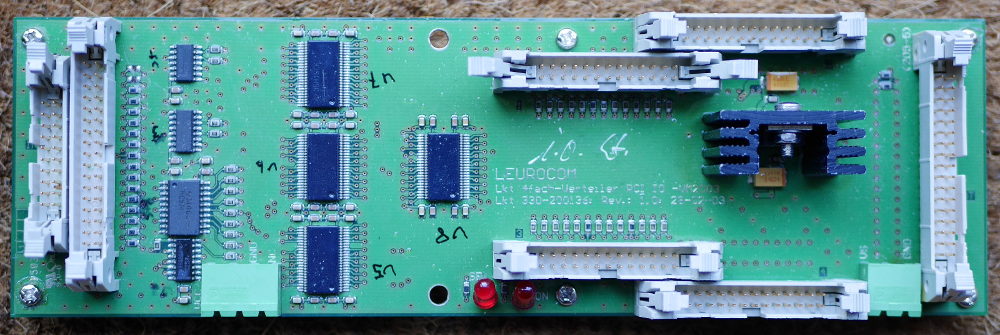
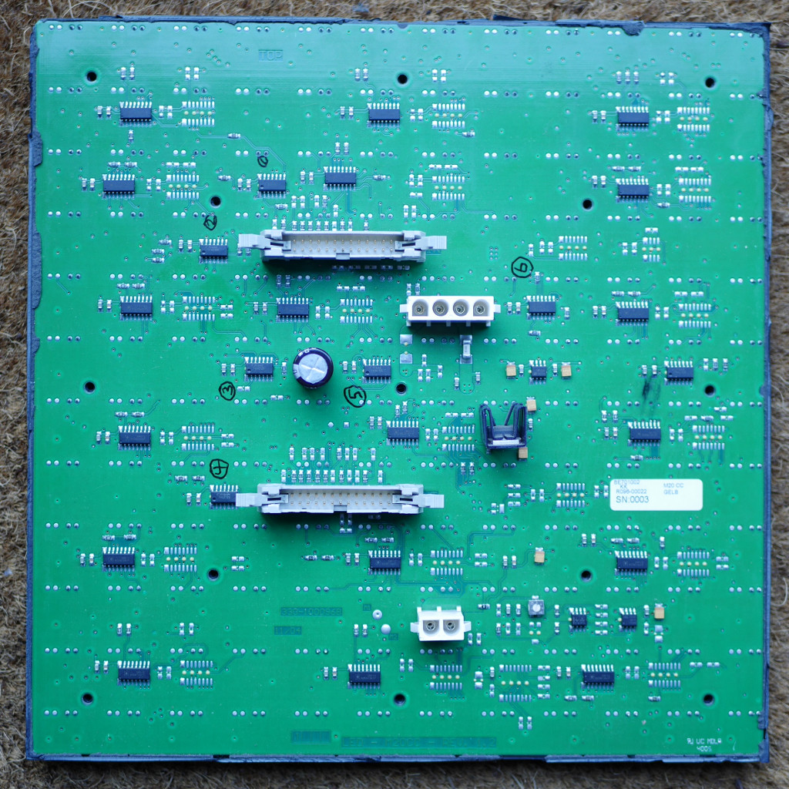

# leuro-m20-bbb

Hardware interface to Leurocom M20 using 
Beaglebone Black mmap'ed GPIO with a cavalier approach.

## Overview

leuro-m20-bbb reads framebuffer updates (see related project 
[caprica](https://github.com/ndf-zz/caprica)
) sent over a Unix domain socket, then writes the framebuffer
to an attached Leurocom M20 monochrome LED display by bit-banging
GPIO pins on a Beaglebone Black. In order to achieve acceptable
refresh times, GPIO set and clear registers are written directly
using mmap-ed pages from /dev/mem.

## Building

Edit the socket, screen configuration, and UID/GID defines
then compile leuro-m20-bbb using make:

	$ make
	cc -Wall -Werror -O3 leuro-m20-bbb.c -o leuro-m20-bbb

## Running

First run the provided script pinsetup.h (or an equivalent process)
to configure GPIO and PWM settings on the relevant Beaglebone Black
pins. Then, as root, run leuro-m20-bbb:

	$ ./pinsetup.sh
	$ sudo ./leuro-m20-bbb

## Hardware Setup

Connect from the Beaglebone Black
P9 expansion header through a ~500 Ohm resistor[1] to the 
non-inverting inputs[2] on the "LED-ADAPTER-KARTE" or directly
to the "LED-OPTO-KARTE". Inverting inputs can be tied together
and connected to a ground pin (eg P9.1, P9.2) or run separately
back to a ground point on the Beaglebone Black. If the display
has a "LEDDIMMER" board, remove it and the connecting ribbon
completely.

Display Line | Function | BBB Pin | GPIO | Note
--- | --- | --- | --- | ---
E5/E5N | | n/c | | not used
E4/E4N | | n/c | | not used
E3/E3N | | n/c | | not used
E2/E2N | icard Transfer | P9.15 | 1:16 |
E1/E1N | icard Select | P9.12 | 1:28 |
E0/E0N | Row Select | P9.26 | 0:14 | if set, T clocks icard latch
S/SN | Show | P9.16 | 1:19 | connects to all panels all the time
T/TN | Transfer | P9.24 | 0:15 |
DI/DIN | Dimmer | P9.14 | pwm1A | 0: on 1: off (setup with sysfs)
HA/HAN | | n/c | | not used
HB/HBN | | n/c | | not used
D1/D1N | Row 4b | P9.11 | 0:30 | row 4 is not used in this case
D2/D2N | Row 4a | P9.13 | 0:31 |
D3/D3N | Row 3b | P9.17 | 0:5 |
D4/D4N | Row 3a | P9.18 | 0:4 | row advance through icard latch
D5/D5N | Row 2b | P9.19 | 0:13 | row 4 select on icard latch
D6/D6N | Row 2a | P9.20 | 0:12 | row 3 select on icard latch
D7/D7N | Row 1b | P9.21 | 0:3 | row 2 select on icard latch
D8/D8N | Row 1a | P9.22 | 0:2 | row 1 select on icard latch

   - [1] On the "LED-OPTO-KARTE" board, A2231 optocouplers
     decode balanced lines from a Leurocom PCI card through a
     220 Ohm series resistor. To get the recommended
     2.5 mA "ON" current from a Beaglebone Black 3.3V GPIO pin,
     an additional ~500 Ohm series resistor is required on each input.

   - [2] Balanced inputs are labeled X/XN where X is the inverting input,
     and XN is the non-inverting input. X connects to the A2231
     cathode, XN connects to the anode. For more information on the
     A2231, see the
     [manufacturer website](https://www.broadcom.com/products/optocouplers/industrial-plastic/digital-optocouplers/5mbd/hcpl-2231).

## Display Mapping

Leurocom displays (viewed from the front-side) are arranged in rows
of LED panels labeled "LED - M20CC" (12x12 pixels in this case),
daisy-chained right to left. Each LED panel has two shift registers
"a" and "b", arranged in 6 rows of 3 columns, each 4 bits wide.
Groups of 3 or 4 LED panel rows are driven from interface cards
labeled "4fach-Verteiler PCI IO -VM2003".
Interface cards are on the right side of the display, connected in a
daisy-chain from bottom to top. Each collection of rows, numbered 1-4
on the interface card, is connected top to bottom.
Framebuffer updates from caprica describe the desired image as a buffer
of 32 bit pixel values packed little-endian[3] from left to right,
top to bottom.

   * [3] Beaglebone Black typically runs little-endian

## Hardware Reference

### LED-ADAPTER-KARTE

Breaks-out opto-coupler inputs to screw terminals. Header pins:

Function | Pin | Pin | Function
--- | --- | --- | ---
D1 | 1 | 2 | HA
D1N | 3 | 4 | D2
HAN | 5 | 6 | D2N
D3 | 7 | 8 | E5
D3N | 9 | 10 | D4
E5N | 11 | 12 | D4N
D5 | 13 | 14 | n/c
D5N | 15 | 16 | D6
n/c | 17 | 18 | D6N
D7 | 19 | 20 | HB
D7N | 21 | 22 | D8
HBN | 23 | 24 | D8N
E0 | 25 | 26 | n/c
E0N | 27 | 28 | T
n/c | 29 | 30 | TN
DI | 31 | 32 | n/c
DIN | 33 | 34 | S
n/c | 35 | 36 | SN
E4 | 37 | 38 | n/c
E4N | 39 | 40 | E3
n/c | 41 | 42 | E3N
E2 | 43 | 44 | n/c
E2N | 45 | 46 | E1
n/c | 47 | 48 | E1N
n/c | 49 | 50 | n/c

### LED-OPTO-KARTE

Decodes balanced line inputs to 5V logic and connects to
dimmer board and first interface card input. In this case, the
opto card passes all logic through to the interface card
without change. The dimmer connection appears to provide
pwm of the DI signal using HA and HB signals - these were not
necessary since the Beaglebone Black can generate clean PWM
internally.

Dimmer Header - 10 pins

Function | Pin | Pin | Function
--- | --- | --- | ---
n/c | 1 | 2 | HB (to dimmer)
VCC | 3 | 4 | HA (to dimmer)
VCC | 5 | 6 | VCC
DI (from dimmer) | 7 | 8 | DI (to dimmer)
GND | 9 | 10 | GND

Interface Card ("PCI") Header - 20 pins

Function | Pin | Pin | Function
--- | --- | --- | ---
E3 | 1 | 2 | E1
E2 | 3 | 4 | E0
T | 5 | 6 | GND
S | 7 | 8 | GND
E4 | 9 | 10 | GND
GND | 11 | 12 | DI
D4 | 13 | 14 | D5
D3 | 15 | 16 | D6
D2 | 17 | 18 | D7
D1 | 19 | 20 | D8

### Interface Card (4fach-Verteiler PCI IO -VM2003)

The interface card provides an array of buffers for distributing
input signals to 4 LED panel rows and the next interface card in the
chain. It also includes an address latch for stepping across the
display.

In/Out Header - 34 pins

Function | Pin | Pin | Function
--- | --- | --- | ---
 GND | 1 | 2 | D8
 GND | 3 | 4 | D7
 GND | 5 | 6 | D6
 GND | 7 | 8 | D5
 GND | 9 | 10 | D4
 GND | 11 | 12 | D3
 GND | 13 | 14 | D2
 GND | 15 | 16 | D1
 GND | 17 | 18 | DI
 GND | 19 | 20 | S
 GND | 21 | 22 | T
 GND | 23 | 24 | E0
 GND | 25 | 26 | E1
 GND | 27 | 28 | E2
 GND | 29 | 30 | E3
 GND | 31 | 32 | Sense
 GND | 33 | 34 | E4/Sense

### M20 CC LED Panel

The M20 CC LED panel is a 12x12 pixel LED display driver with
2 shift registers and logic to propagate signals along a chain
of panels.

In/Out Header - 26 pins

Function | Pin | Pin | Function
--- | --- | --- | ---
 GND | 1 | 2 | Top Data (D2, D4, D6, D8)
 GND | 3 | 4 | Bottom Data (D1, D3, D5, D7)
 GND | 5 | 6 | Clock (T)
 GND | 7 | 8 | S (Latch pixels)
 GND | 9 | 10 | DI (Display inhibit)
 GND | 11 | 12 | VCC (via pull-up)
 GND | 13 | 14 | Row transfer (latched D4)
 GND | 15 | 16 | n/c
 n/c | 17 | 18 | n/c
 n/c | 19 | 20 | Row Select (latched D5-D8)
 n/c | 21 | 22 | VSS
 VSS | 23 | 24 | GND
 VSS | 25 | 26 | GND
